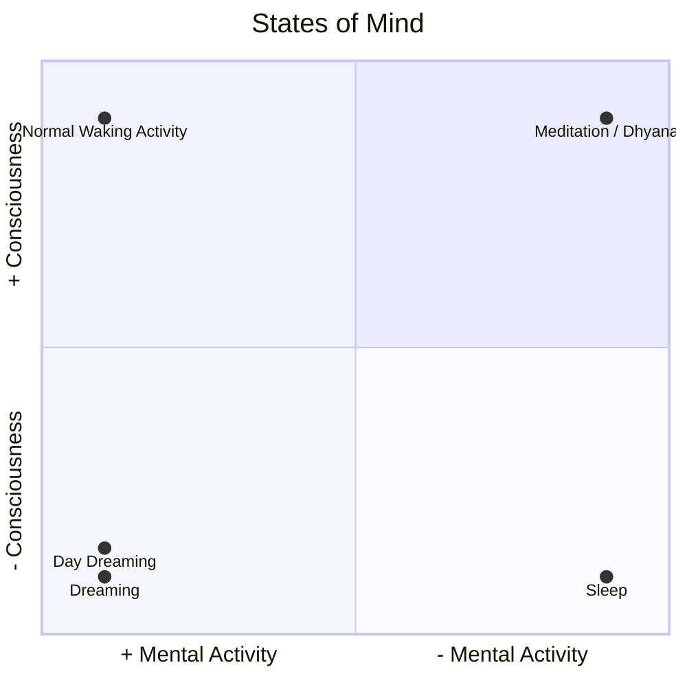
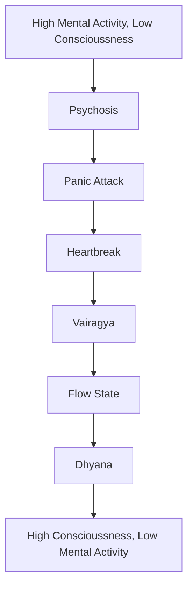

---
aliases:
  - conscious
  - State of Mind
  - States of Mind
---
The fundamental quality of [[sakshi bhava]].

According to [[Yoga]], consciousness or awareness is in the form of motion or vibration.

#### States of Mind
We have various states of [[Mind]] and those states of [[Mind]] have varying degrees of [[Consciousness]], or or mental activity.

Normal Waking Activity:  + Mental Activity, + Consciousness
Sleep ([[Sushupti]]):  - Mental Activity, - Consciousness
Dreaming:  + Mental Activity, - Consciousness
DayDreaming:  + Mental Activity, - Consciousness
- *When we "get lost" in a day dream, we have mental activity without awareness.
- When we "snap out" of a daydream, we move from a state of mental activity without awareness to a state of mental activity with awareness.
Meditation ([[Dhyana]]):  - Mental Activity, + Consciousness
- *Example: Watching the dawn / dusk. Putting your feet in the ocean. Conscious, but low mental activity.*

The following are examples of states of [[Mind]] on a *spectrum* between *mental activity (mind)* and consciousness.
The left states are higher states of [[Mind]] (and lower states of consciousness, and the right states are higher states of conscious (and lower states of mind).
[[Psychosis]] > [[Panic Attack]] > [[Heart Break]] > [[Vairagya]] ("Take a step back; realizing the relation was bad, etc. Realizing we are not our thoughts / reality is not our thoughts, etc.") > [[Flow State]] > [[Dhyana]]

###### Jagrat, wakefulness
The state of Jagrat, wakefulness, exists in these four states:
- _Jāgrat_ ([[Jagrat]]) - wakefulness
- _Jāgrat svapna_ (Jagrat Svapna) - Deep imagination. Dreaming in the state of wakefulness.
- _Jāgrat Suṣupti_ (Jagrat Susupti) - Deep sleep in the state of wakefulness.
- _Jāgrat Turīya_ (Jagrat Turiya) - a super-conscious state.

###### Three Dimensions of Consciousness
The individual consciousness is comprised of three stages, or, dimensions:
- The sense or objective **consciousness**
- The **subjective** or astral consciousness
- The **unconsciousness** or mental state of dormant potentiality.

The consciousness can take its input from the [[Indriya]]s, your [[Imagination]]

###### Footnotes
---
Related: [[Nature of Mind]], [[Samadhi#Three streams of awareness]]