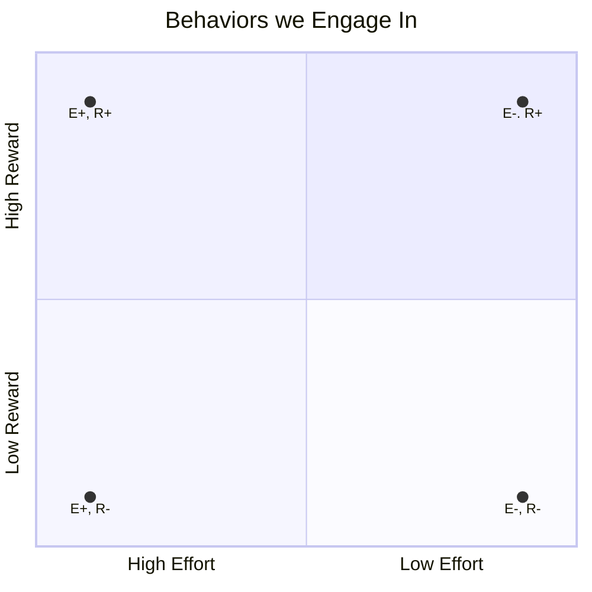

The part of our brain that calculates efficiency.

```mermaid

quadrantChart
    title Behaviors we Engage In
    x-axis High Effort --> Low Effort
    y-axis Low Reward --> High Reward  
    E+, R-: [0.1, 0.1]
    E-, R-: [0.9, 0.1]
    E+, R+: [0.1, 0.9]
    E-. R+: [0.9, 0.9]
```
