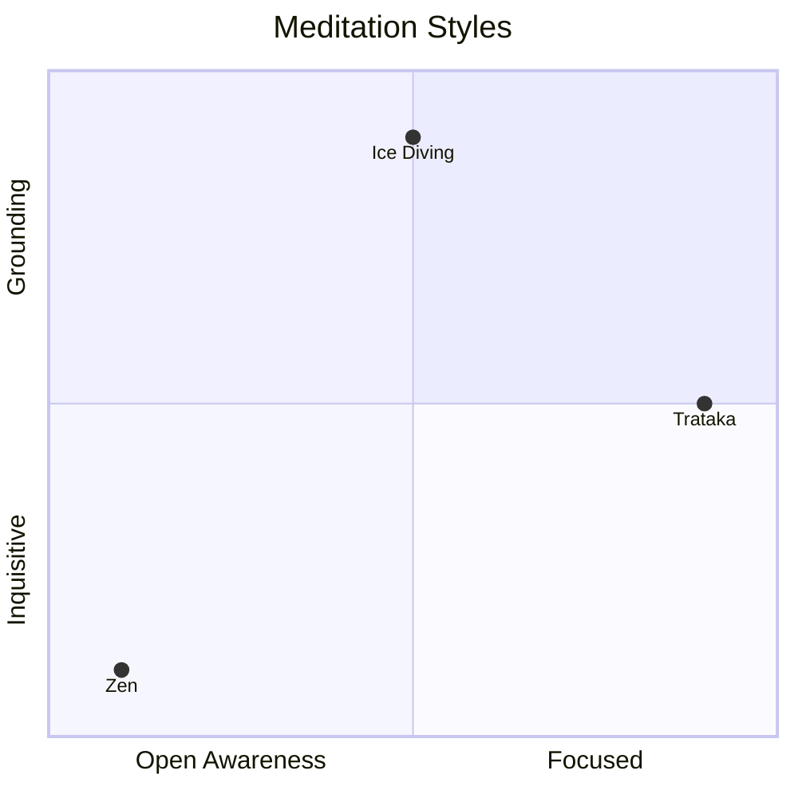

---
aliases:
  - meditative styles
---

Different forms of meditation produce different brain wave states.

To contrast different meditation styles, consider these two axes:
y-axis: [[Grounding Meditation Technique]]s vs [[Inquisitive Meditation Technique]]s
x-axis: [[Open awareness meditation technique]] vs [[Focus based meditation technique]]

[[Zen]] - an Open Awareness + Inquisitive / Exploratory practice
[[Trataka]] - a Focus practice
[[Ice Diving]] - a Grounding practice

[[Kundalini Yoga]] - good for people with a goal in mind.