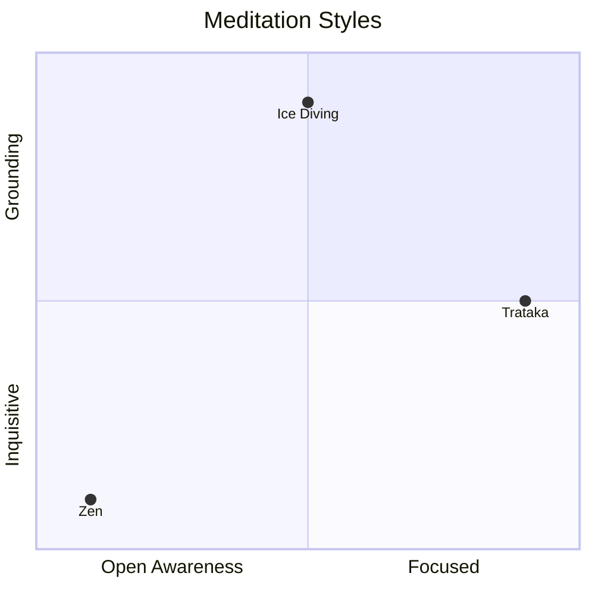

---
aliases:
  - meditative styles
---
Not all forms of meditation are suitable for all people. Different kinds of meditation are suitable for different kinds of people.
	For example, [[mindfulness]] practices would be bad for someone who has [[Post Traumatic Stress Disorder|PTSD]]. The [[Mind]] of someone with [[Post Traumatic Stress Disorder|PTSD]] is working hard to keep some things buried. If they empty their mind, their traumatic energy will come rushing up. The best meditation techniques for someone with [[Post Traumatic Stress Disorder|PTSD]] are [[Grounding Meditation Technique|grounding techniques]] (which are the opposite of awareness techniques). Grounding techniques causes the memories which are threatening to break into their [[Mind]] to go dormant.

Different forms of meditation produce different brain wave states.

To contrast different meditation styles, consider these two axes:
y-axis: [[Grounding Meditation Technique]]s vs [[Inquisitive Meditation Technique]]s
x-axis: [[Open awareness meditation technique]] vs [[Focus based meditation technique]]

[[Zen]] - an Open Awareness + Inquisitive / Exploratory practice
[[Trataka]] - a Focus practice
[[Ice Diving]] - a Grounding practice

[[Kundalini Yoga]] - good for people with a goal in mind.