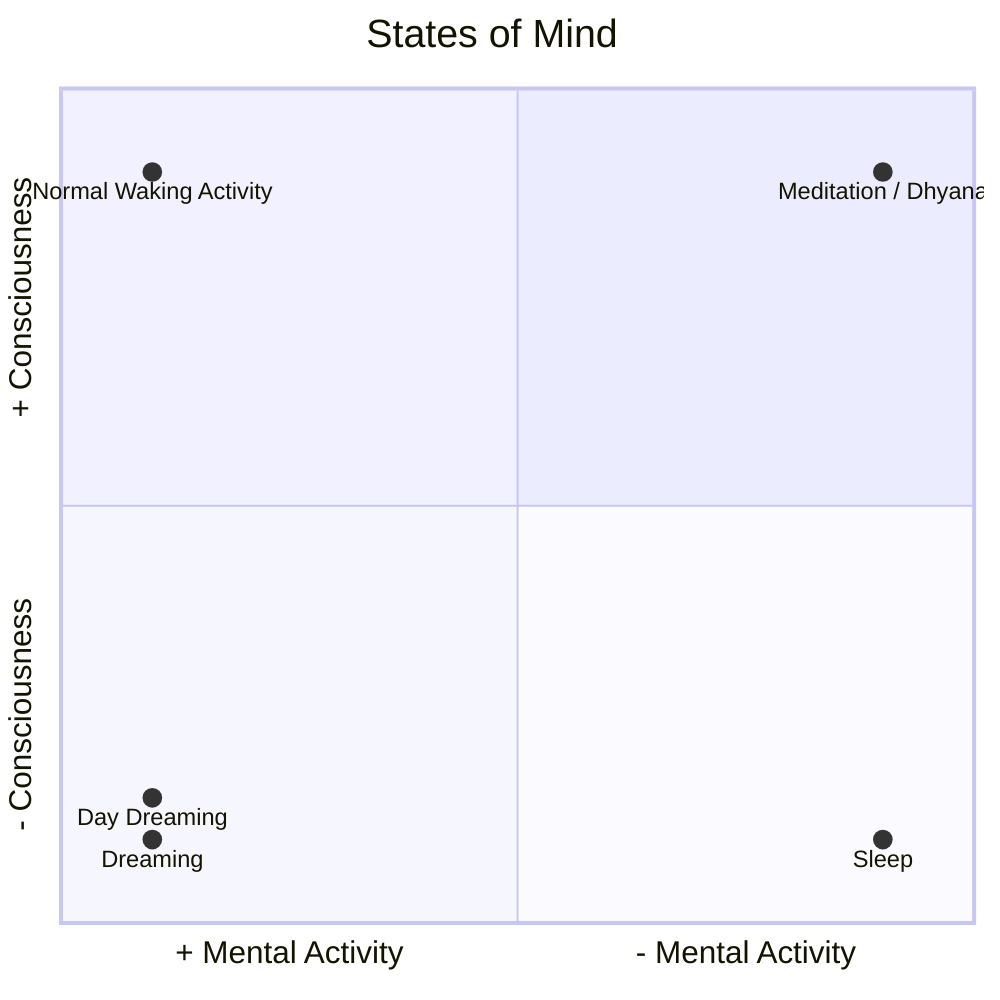
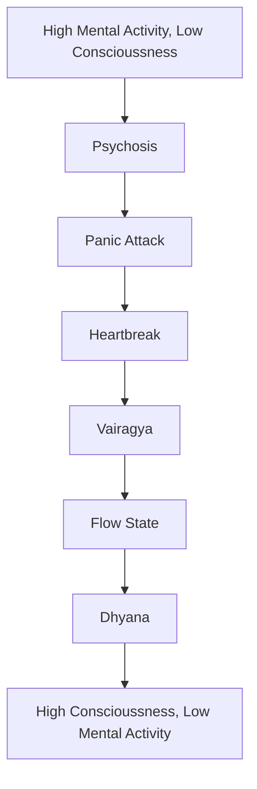

###### [[Sakshi Bhava]]
The yogis noticed that we have a capacity to observe our own mind. There's a part of self (the truest self) that's outside of the mind. There are mental functions like thoughts & emotions; then there's an observer outside of that. In [[mindfulness]], we call this consciousness [[Sakshi Bhava]]. It is not a part of the mind because it is able to look at the other parts of mind.

The observer & the observed are two fundamentally different things. When you look in the mirror, you see a [[Representation|reflection]] of yourself, not yourself. A photo of you is an [[image]] of you.

These observations led to what we will call [[consciousness]].

We have various states of mind and those states of mind have varying degrees of [[consciousness]].

There are various states of mind.
Some states of mind have different degrees of consciousness or mental activity.

Normal Waking Activity:  + Mental Activity, + Consciousness
Sleep:  - Mental Activity, - Consciousness
Dreaming:  + Mental Activity, - Consciousness
DayDreaming:  + Mental Activity, - Consciousness
	*When we "get lost" in a day dream, we have mental activity without awareness.
	When we "snap out" of a daydream, we move from a state of mental activity without awareness to a state of mental activity with awareness.
Meditation ([[dhyana]]):  - Mental Activity, + Consciousness
	*Example: Watching the dawn / dusk. Putting your feet in the ocean. Conscious, but low mental activity.*

The following are examples of states of mind on a *spectrum* between *mental activity (mind)* and consciousness.
The left states are higher states of Mind (and lower states of consciousness, and the right states are higher states of conscious (and lower states of mind).
[[Psychosis]] > [[Panic Attack]] > [[Heart Break]] > [[Vairagya]] ("Take a step back; realizing the relation was bad, etc. Realizing we are not our thoughts / reality is not our thoughts, etc.") > [[Flow State]] > [[dhyana]]

[[Cognitive Behavioral Therapy|CBT]] noticed [[thought fusion]]. One of the goals of [[Cognitive Behavioral Therapy|CBT]] is to train people to move from states of [[thought fusion]] to states of [[thought diffusion]]. This is also one of the goals of [[meditation]].

The realization that the mind is not our true self is important, not only for optimizing our performance, but is clinically useful for any mental illness. Studies have been done on everything from [[depression]] to [[anxiety]] to [[schizophrenia]] to even [[trauma]], demonstrating that [[Meditation|meditation]] is an effective treatment for all of them.

---
Related: [[Knowledge and Mind]], [[System of Mind]]