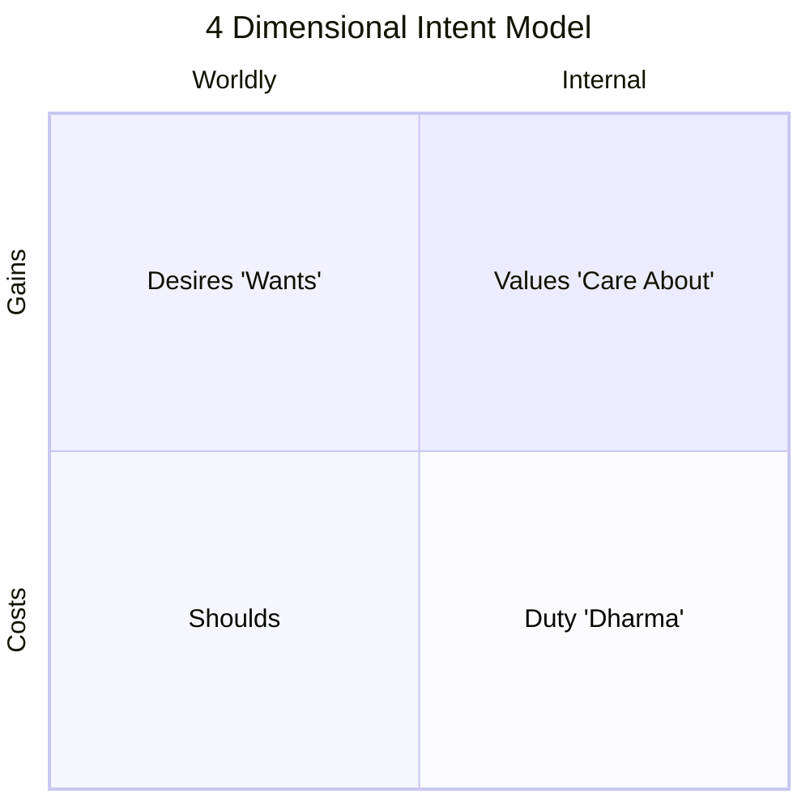

- Achieve optimal sex appeal
- Become a great Yogi
- Move out
	- To where?
	- Get a job
- Find high quality relationship
	- Open up; do new things; engage more (sobriety motivation).
- Semen Retention

7 Areas of Life:
Business, physical, personal, Spiritual, spouse/partner, family, and community

---
#### Self-Reflection Exercise
Dissect out the intent of your goal in the Desire / Value / Should / Duty chart below to determine where your motivations for this goal lie.

**How can you reframe your motivations so that it aligns with the right column?**
*Example: For a goal of getting a job, we can shift the motivation of "wanting prestige among peers" or "should get a job be cause your parents expect it of you" to focusing on values of self-independence.*

---
Related:
[[Dimartini Values inventory]]
[[personal core values]]
[[personal vision]]
[[Organizational System Goals]]
[[Lessons I Need to Learn]]
[[Planning & Goal Setting - Intent Model]]
[[Common Pitfalls in Goal Setting]]