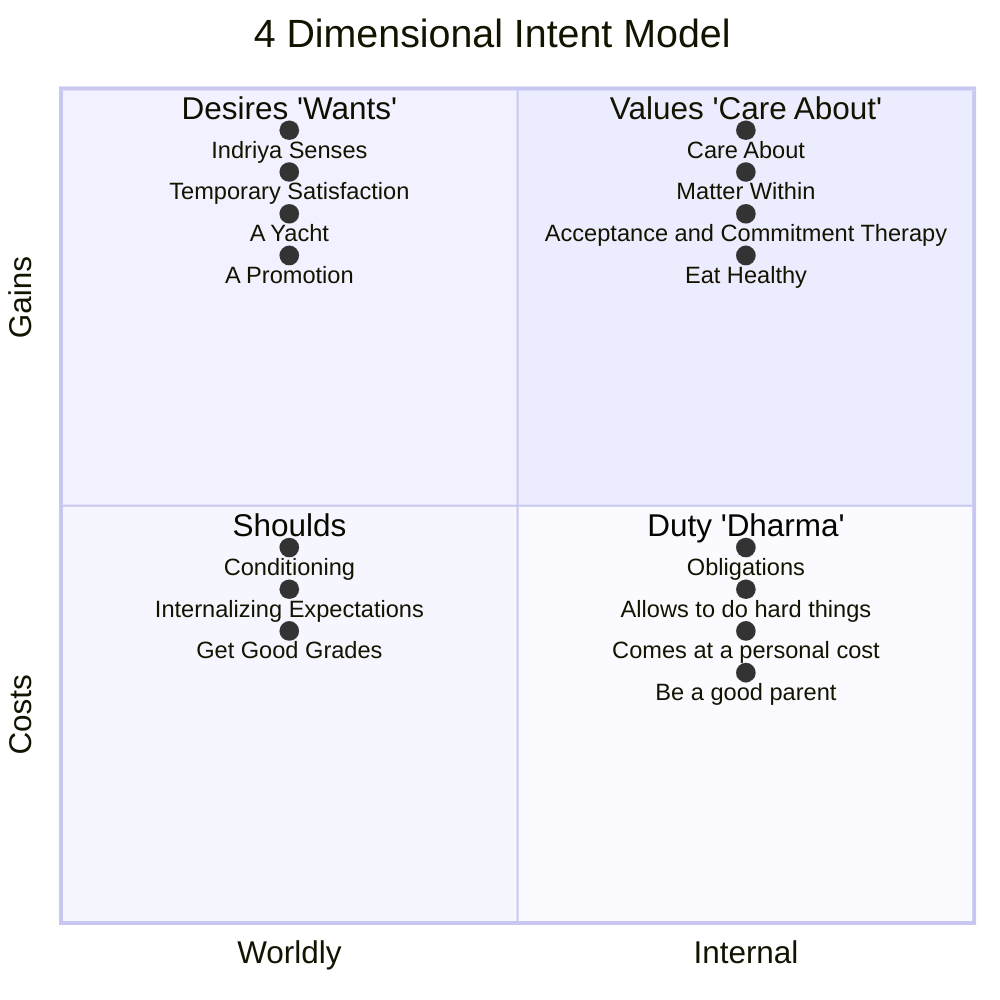
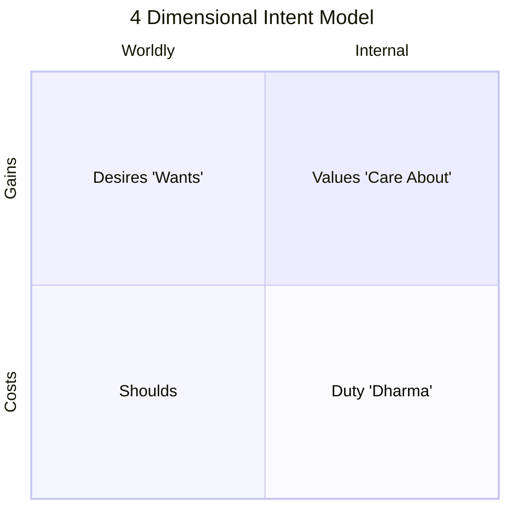

We can set all kinds of goals, but unless they come from the right place, we struggle to find the motivation to achieve them.

There are probably some goals in your life you're highly motivated to do, but others which you *should* do, but struggle to enact upon.

#### Origin of a goal
Where do goals come from in our [[Mind]]?
	*Example: Harvard medical students. Harvard medical students are usually try hard winners who worked hard & did well their whole life. But, if you keep rising in life, eventually you will be average, somewhere. Grades at Harvard medical are stack ranked. 50% of them are going to get below average grades, and these are people who have never been below average in their life & hate not excelling. The goals these people have been setting were appropriate for those phases in their life, but at this point in life, they need to frame shift. Why are you at medical school for? To get an A? Or, to learn to save lives? When called upon in an emergency, you don't get to say, "sorry, I got bad grades, I can't help", or "I got the best grades" - all that matters is real performance, not the grades. But, these people have been conditioned for over a decade to strive for the wrong goal - grades. The students who are devoted to learn medicine to help people are also the ones who perform the best in the real world when they get out of school. The ones who can adopt such a mindset are protected against despair if / when they get below average grades - they interpret sub-par grades as opportunities to learn more. Where your goal comes from matters.*

Think about the goals you have in life - where did they come from? How did you decide on your profession?
Or, the people in your life - how did they decide on their professions?

The truth is, most of our goals come from the outside in some way. We are conditioned by cultural influence. When we do something like that, we aren't actually motivated. The motivation isn't coming from us. It's coming from things like societal respect. What other people will think about you. What your parents will get to brag about. These are not good sources of intrinsic motivation. When you choose a career based on what will make your parents happy, sure that pressure is real, but it isn't going to internally drive you to succeed.

Our goals come from our [[Indriya|Indriya]]s. Monkey see, monkey do.
	*Anecdote: "80% of the Indian kids in my high school wound up being doctors. Is that because Indian kids make better doctors? No, it's entirely cultural.*
This is how we understand peer pressure - how you dress; the stuff you want to buy, etc.

Most people aren't motivated towards their profession for their own sake. Their actual motivation is trying to make their parents happy - not wanting them to yell at you, or to get them off your back. Where our goal comes from heavily influences how motivated we are to do it.

How can we find motivation to stay up extra, work extra hard, work extra hard for a goal we "should" do? We can do this by reframing our goals to align our actions to internal goals. To do that, we need to understand the origin of goals.

**[[Desire|Desires]]** - come from the **[[Indriya]]s**, are **transient** in nature, and **don't drive** a lot of **motivation**. 

I don't have to have an experience to get a desire; I just need a sensory experience / impression. Marketing bombards you with sensory impressions.
	I want a Yacht, even though I have never stepped foot on one. They seem cool & it seems like people have fun on them. How is this thought possible? I got the idea that a Yacht would be nice through my [[Indriya]]s. Even though I "want" a yacht, I don't wake up every day, thinking about it: "I'm going to work extra hard today because it will get me one step closer to the Yacht."

The satisfaction [[Desire|desires]] lead to is **temporary** in nature.
	*When someone else gets a promotion, you want a promotion, then after you get a promotion, you're only satisfied for a little while.*

**[[Shoulds]]** - come from our conditioning. They come from internalizing the expectations of other people, which are outside of us. Society, parents, other people. Our level of motivation towards things we should do is very low.
	*That's why you say they're things you -should do- instead of things you -do-.*
Many people's goals are just a bunch of -shoulds-.

[[Values]] - Things you care about. Things that matter to you. Come from within. When you care about something, you're much more likely to engage with it. How do you know the difference between something you want & something you care about?
*Example 1: Eating healthy. One group of people want to eat healthy as a desire. That means it requires a lot of willpower & effort to do, because it isn't natural. Another group of people care (are intrinsically motivated) about taking care of their body. Since they care about taking care of their body, it's also easier for them to eat healthy. If you ask them what they want to eat, they still want to eat unhealthy food, but they choose the healthier food instead of the tastier food.
Even though the goal can be the same (eat healthy), the origin of the goal will determine your level of intrinsic motivation towards it.*
There's some interesting research on values - there's an evidence based psychotherapy practice called [[Acceptance and Commitment Therapy]] which basically says that overcoming desires involves discovering what your values are and then starting to live in accordance with them.

**Duty ([[Dharma]])** - things we're obligated towards. What's the difference between a duty and something you "should" do? duties are obligations that your yourself adopt. You get to decide - "what does it mean to be a parent? A sibling? A friend?" You can adopt those things within yourself and accept those values. On the flip side, the values which society imposes on you which you don't accept are the [[Shoulds]]. It's kind of subtle.

Thinking about your [[Dharma]] is very important, because it **allows you to do hard things.**
	*Example of a doctor: I don't like to work for 24 hours in one stretch. It kind of sucks. It kind of sucks to work for 4 hours in one stretch. I put myself through that willingly because I think about my duty as a physician. Society has invested in training me with these skills, and it's my duty to use those skills for the benefit of my patients. Even though it comes at a personal cost, I'm willing to sacrifice that personal cost for the sake of my obligation.*

[[Dharma]] comes at a personal cost.
	*Example: to be parent, you have to give up a lot of stuff for the sake of your kids. We bear this cost because it's an obligation as a parent to live up to our [[Dharma]]*.

**Gains vs Costs*; Worldly vs Internal Axes**
When we satisfy a desire, we get a worldly gain; it's transient.
When we do things we value, we get an internal gain because we're living in service to our values. Sure, there may be health benefits to eating healthy, but if it's my value, then I get to take pride in my choices.
When we do something we [[Shoulds|should]] do, we're satisfying something outside of us. We're doing something for the world.
When we do our [[Dharma]], even though it costs me something, I get an intrinsic benefit (like knowing that I am a good parent).
	*10 years from now, my kids may not ever realize the benefit that they receive, or the cost that I paid to keep them away from a screen for 8 hours in a day (it costs me something, because if I let them sit on a screen for 8 hours, then I can do the same thing, too).*

When we have goals from the left side of the table, we end up with goals that don't come with a lot of intrinsic motivation. They're goals with worldly outcomes. The tricky thing there is that, if we don't get the worldly outcome, it kills our motivation.
	*Because the reason I'm doing this thing is to make my parents happy. And if I do it and they're still not happy, then why the hell am I even doing it? First they wanted me to be a doctor, then they want me to be a neurosurgeon; so I'll stop doing it entirely & quit.*

When we operate from the right side of the table, we receive internal benefits. The more we align ourselves with intrinsic benefits, the more we'll find intrinsic motivation.

#### Self-Reflection Exercise
Dissect out the intent of your goal in the Desire / Value / Should / Duty chart below to determine where your motivations for this goal lie.

**How can you reframe your motivations so that it aligns with the right column?**
*Example: For a goal of getting a job, we can shift the motivation of "wanting prestige among peers" or "should get a job be cause your parents expect it of you" to focusing on values of self-independence.*