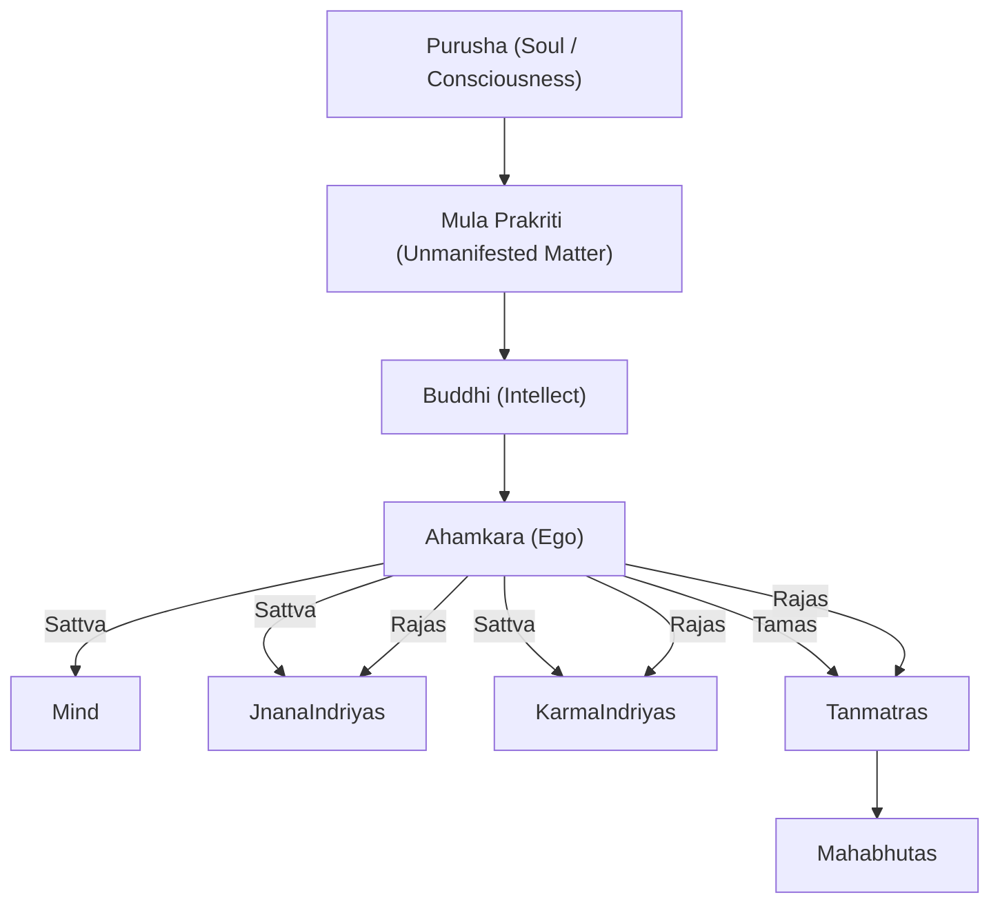

---
aliases:
  - Tattva
---
Alias: Tattva

"thatnesses" or principles or categories

The 25 primary elements.

- [[Purusha]] (Soul / Consciousness)
- Mula Prakriti (Unmanifested Matter)
- [[Buddhi]] (Intellect)
- [[Ego|Ahamkara]] (Ego)
	- [[Manas]] ([[Mind]])
	- [[Indriya#The five Jnana Indriyas]]
	- [[Indriya#The five Karma Indriyas]]
	- [[Tanmatra]]s

