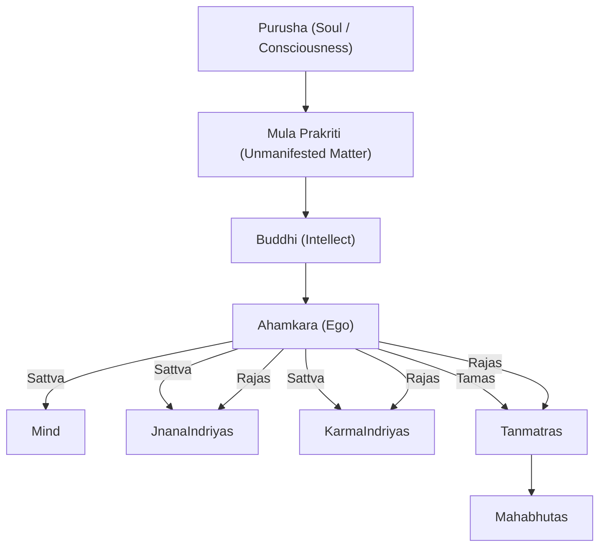

---
aliases:
  - Tattva
---
Alias: Tattva

"thatnesses" or principles or categories

The 25 primary elements.

- [[Purusha]] (Soul / Consciousness)
- Mula Prakriti (Unmanifested Matter)
- [[Buddhi]] (Intellect)
- [[Ego|Ahamkara]] (Ego)
	- [[Manas]] ([[Mind]])
	- [[Indriya#The five Jnana Indriyas]]
	- [[Indriya#The five Karma Indriyas]]
	- [[Tanmatra]]s

#### Tantric View
Tantrism explains our constitution and experiences in terms of tattvas.

The absolute doesn't exist in time.

// incomplete - 2 realms

Tantras of the Northern School (Kashmir) recognize thirtysix tattvas, which are divided in three groups: pure (shudda-tattva); pure and impure (ashudda-shudda-tattva); and impure (ashudda-tattva).

Impurity in this context refers to the degree to which something alien, or something of a different nature (idam), is found in the corresponding level of each group. According to this distinction, however, even shudda-tattvas are somehow impure, since only the supreme synthesis is, properly speaking, absolutely pure.
- // This synthesis cannot be included in the series because it is the foundation and the substance of each tattva. It is called parasamvid, a supreme, omniscient power, and it needs to be considered aside from the real tattvas. This synthesis is also designated as a state in which Shakti "enjoys herself" (svarupavishranti) and as the I's self-knowledge.

From a cosmological point of view, the three groups of tattvas can be compared to the "three worlds" of the Hindu tradition: the world without forms (arupa); the world of pure forms (rupa); and the material world. The worlds correspond to the essential, subtle, and crude states of the manifestation. The groups may also be related to the first three states of atman's existence.
- // (in this case the fourth state, turiya should Be seen as parasamvid's complement).

The 3 Gunas.
// TODO: incomplete.

The source point, or [[Bindu]], corresponds to the loss of the gunas' equilibrium, which according to Sankhya originates the development of the world.

##### The Five Kankukas
Kankuka means "sheath".
###### 1) Time
Time (kala), understood as the universal form of the elements found in a sequence.
[[Atman]], or the purushic/ Shaivist principle, will never fully identify with particular and finite forms proper to a given state of existence. Therefore, [[Atman]] is led from one experience to another.
###### 2) Raga
[[Raga]] means passion, or attachment.

Once the fullness or wholeness proper to bindu-tattva falls short, the finite consciousness is existentially attracted toward different objects, thus originating a temporal succession and the process of becoming.

This consciousness is caught in a web of dependencies, which for the most part derive from causality and irreversibility, especially if we consider that every point in time is conditioned by two factors: the previous one, from which it proceeds, and the following one, toward which it orients itself, out of an unconscious yearning for the Absolute.

One may refer here to the opinion according to which action (karma) generates ignorance (avidya), which in turn generates more karma, and so on.5 The point being made is that the state in which being or the other or the very same I, are not "known" generates in turn desire and actions conditioned by desire. Actions performed under the influence of desire tend to confirm this illusory duality, however, and increasingly tie the I to something apparently other than itself. As a result, the I becomes increasingly needy and restless, as it moves further along the temporal series and the process of becoming, all the while experiencing recurring delusions and new needs.

###### 3) Niyati
